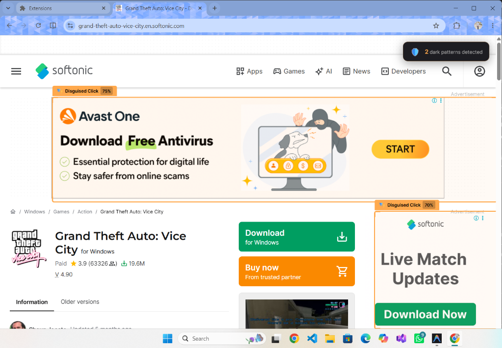
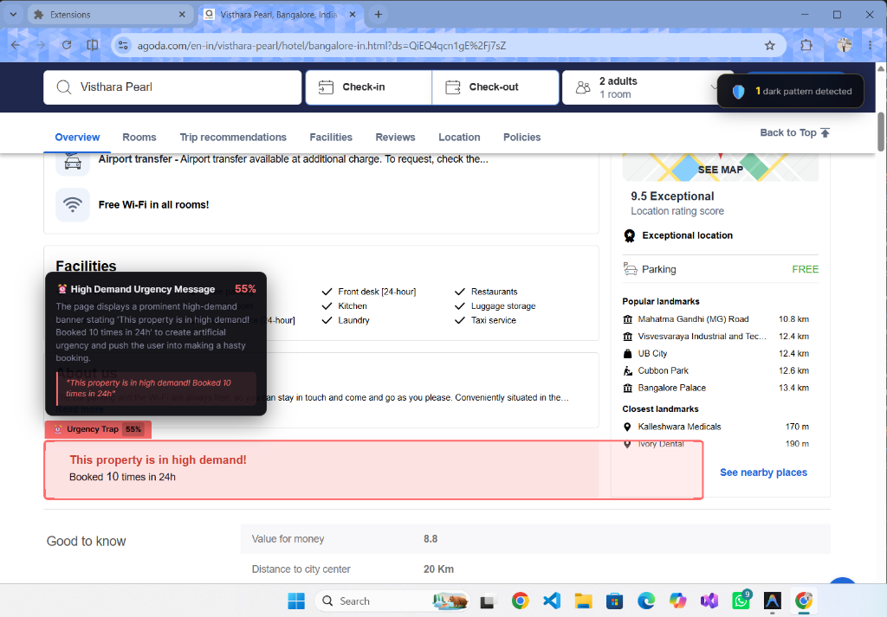
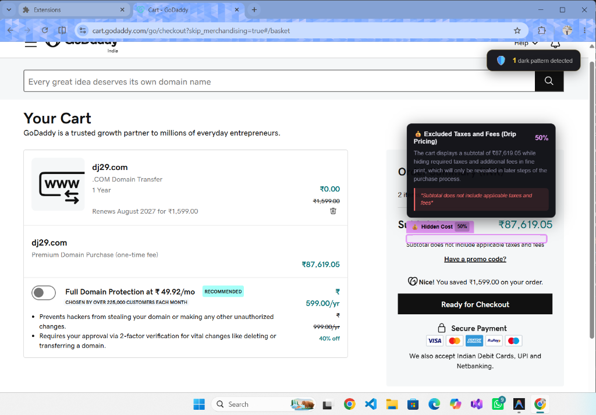
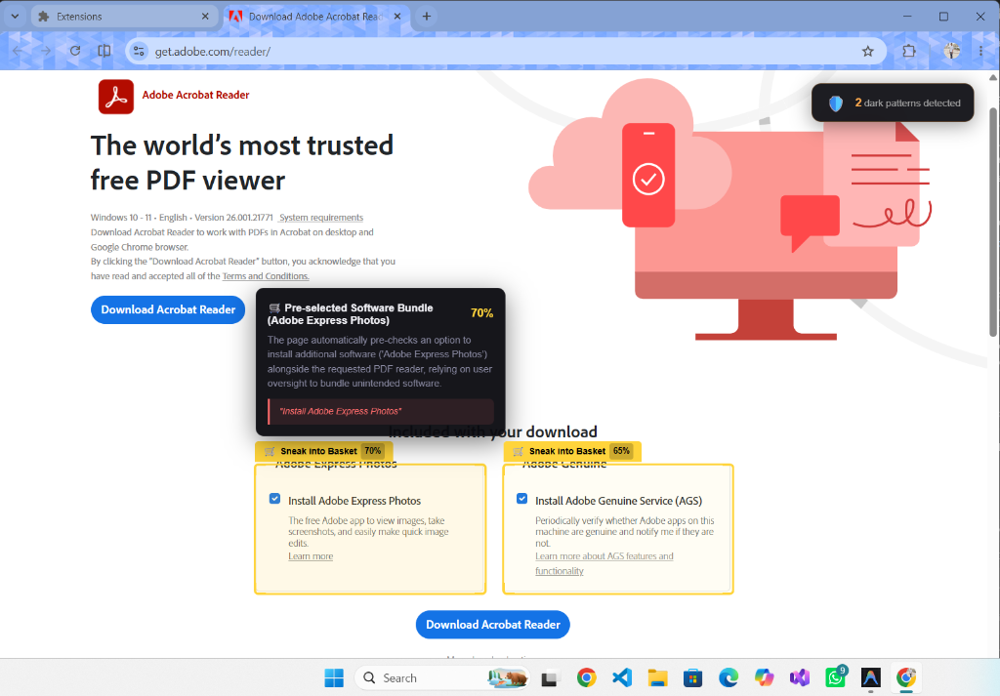
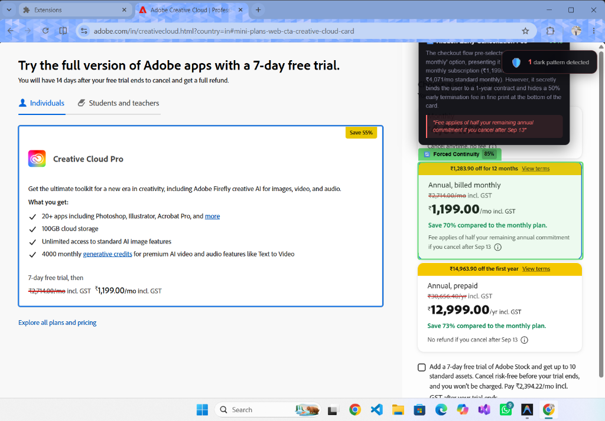

# 🛡️ OmniGuard AI

> **Real-Time Multimodal Dark Pattern & Visual Deception Radar**

OmniGuard AI is a Chrome browser extension that acts as a **cognitive visual shield** against deceptive UI/UX. Powered by **Gemini 3.7 Flash**, it captures what users *actually see* on a webpage, detects **dark patterns** in real-time, and overlays **live bounding boxes** directly on the deceptive elements — **before users can click.**

*Built by [Tarkash Labs](https://github.com/Tarkash-Labs)*

---

## ✨ Features

OmniGuard detects **6 categories** of dark patterns in real-time:

| Category | Description | Example |
|----------|-------------|---------|
| ⏰ **Urgency Traps** | Fake countdowns & artificial scarcity | *"Only 2 left! Order in 03:22!"* |
| 🎭 **Disguised Clicks** | Buttons masquerading as something else | Fake download buttons, hidden ads |
| 🛒 **Sneak into Basket** | Unwanted items silently added | Pre-checked insurance add-ons |
| 🔄 **Forced Continuity** | Subscription traps & hidden renewals | Free trial → auto-charge |
| 😢 **Confirmshaming** | Guilt-loaded opt-out language | *"No thanks, I hate saving money"* |
| 💰 **Hidden Costs** | Fees revealed late in the journey | Surprise checkout surcharges |

### How It Works

1. **Browse normally** — visit any webpage
2. **Scan the page** using one of two modes:
   - 🖱️ **Manual Mode** — Click **"Scan This Page"** in the extension popup
   - 🔄 **Auto-Scan Mode** — Toggle **"Auto-Scan on Scroll"** to automatically analyze the page as you navigate (debounced to save API credits)
3. **Viewport screenshot** is captured ephemerally (never stored — zero-DB architecture)
4. **Gemini 3.7 Flash** analyzes the screenshot with multimodal reasoning (auto-fallback to **Gemini 3.6 Flash** if needed)
5. **Bounding boxes** are overlaid directly on deceptive elements via Shadow DOM
6. **Tooltips** reveal the category, risk score, and a plain-English explanation

---

## 📸 Demo

OmniGuard AI in action — detecting hidden dark patterns on popular websites:

### 1. Disguised Clicks
OmniGuard detecting fake download buttons on Softonic.


### 2. Confirmshaming
OmniGuard catching manipulative guilt-tripping language on Ryanair's subscription prompt.


### 3. Urgency Traps
OmniGuard flagging fake high-demand scarcity messages on Agoda.


### 4. Hidden Costs (Drip Pricing)
OmniGuard highlighting excluded taxes and fees hidden in the fine print on GoDaddy.


### 5. Sneak into Basket
OmniGuard identifying pre-checked, unwanted software bundles on the Adobe download page.


### 6. Forced Continuity
OmniGuard exposing hidden early termination fees in a "free trial" on Adobe Creative Cloud.


---

## 🏗️ Architecture

```
Extension (React 18 + Vite)          FastAPI Backend              AI Engine
┌─────────────────────────┐    ┌──────────────────────┐    ┌────────────────┐
│ Popup UI                │    │ POST /analyze        │    │ Gemini 3.7     │
│ Service Worker          │───▶│ Multimodal prompt    │───▶│ Flash          │
│ Content Script (overlay)│◀───│ JSON response        │◀───│ (Fallback:     │
└─────────────────────────┘    └──────────────────────┘    │ Gemini 3.6     │
     Manifest V3                    Stateless              │ Flash)         │
     Shadow DOM                     Zero-DB                └────────────────┘
                                                              Multimodal
```

> 🔒 **Privacy First:** Viewport screenshots are processed in-memory and **never stored**. The entire backend is stateless with a zero-database architecture.

---

## 🔄 Fallback Model

OmniGuard uses **Gemini 3.7 Flash** as the primary AI engine and **Gemini 3.6 Flash** as the automatic fallback model. Both models run on the **same Google Gemini API key** — no additional keys or third-party services required.

If the primary model is temporarily unavailable (rate limits, downtime, etc.), OmniGuard seamlessly falls back to Gemini 3.6 Flash with zero configuration needed.

**Want to use a different Gemini Flash model?** Simply update the model ID in your `.env` file:

```env
# Primary model (default: gemini-3.7-flash)
GEMINI_MODEL=gemini-3.7-flash

# Fallback model (default: gemini-3.6-flash)
FALLBACK_MODEL=gemini-3.6-flash
```

Both models use the same `GEMINI_API_KEY`, so swapping model versions is as easy as changing the model ID string. Any Gemini Flash model compatible with the `google-genai` SDK will work.

---

## 🚀 Quick Start

### Prerequisites

- **Python 3.10+** (for the backend)
- **Node.js 18+** & npm (for the extension build)
- **Google Chrome** (Manifest V3 support)
- **Gemini API Key** — get one free at [aistudio.google.com/apikey](https://aistudio.google.com/apikey)

### 1. Clone the Repo

```bash
git clone https://github.com/Tarkash-Labs/OmniGuard.git
cd OmniGuard
```

### 2. Start the Backend

```bash
cd backend

# Create virtual environment (recommended)
python -m venv venv
venv\Scripts\activate        # Windows
# source venv/bin/activate   # macOS/Linux

# Install dependencies
pip install -r requirements.txt

# Configure your API key
copy .env.example .env       # Windows
# cp .env.example .env       # macOS/Linux

# Edit .env and add your GEMINI_API_KEY

# Start the server
python main.py
```

The backend will start at `http://localhost:8000`. Verify with:

```bash
curl http://localhost:8000/health
```

### 3. Build the Extension

```bash
cd extension

# Install dependencies
npm install

# Build for production
npm run build
```

### 4. Load in Chrome

1. Open Chrome and navigate to `chrome://extensions`
2. Enable **Developer mode** (toggle in top-right)
3. Click **"Load unpacked"**
4. Select the `extension/dist` folder
5. The OmniGuard AI icon will appear in your toolbar!

### 5. Use It

1. Navigate to any website
2. Click the **OmniGuard AI** extension icon
3. **Manual Mode:** Click **"Scan This Page"**
4. **Auto-Scan Mode:** Toggle **"Auto-Scan on Scroll"** — the extension will automatically scan as you navigate
5. Watch bounding boxes appear over detected dark patterns!

---

## 🛠️ Tech Stack

| Layer | Technology | Purpose |
|-------|-----------|---------|
| Extension UI | React 18 + JavaScript (JSX) | Popup interface |
| Extension Build | Vite | Fast bundling for MV3 |
| Extension Runtime | Manifest V3 APIs | Tab capture, service worker |
| Overlay System | Shadow DOM + CSS | Non-destructive visual warnings |
| Backend | Python FastAPI | Async request orchestration |
| Primary AI | Gemini 3.7 Flash | Multimodal dark pattern detection |
| Fallback AI | Gemini 3.6 Flash | Seamless fallback on same API key |
| Streaming | SSE (Server-Sent Events) | Real-time inference updates |

---

## 📁 Project Structure

```
OmniGuard/
├── backend/
│   ├── main.py              # FastAPI app + /analyze endpoint
│   ├── models.py            # Pydantic request/response models
│   ├── prompts.py           # Gemini prompt templates
│   ├── requirements.txt     # Python dependencies
│   └── .env.example         # Environment variable template
│
└── extension/
    ├── manifest.json         # Chrome MV3 manifest
    ├── package.json          # Node dependencies
    ├── vite.config.js        # Vite build configuration
    ├── public/icons/         # Extension icons
    └── src/
        ├── constants.js      # Shared configuration
        ├── popup/            # React popup UI
        │   ├── Popup.jsx
        │   ├── Popup.css
        │   ├── main.jsx
        │   └── index.html
        ├── background/
        │   └── service-worker.js  # Tab capture + API orchestration
        └── content/
            └── content.js    # Bounding box overlay renderer
```

---

## 👥 Team

| Name | Role |
|------|------|
| **Dhruv Jani** | 🎯 Team Lead |
| **Yug Vasava** | 💻 Lead Developer |
| **Avadh Vaishnani** | 🧪 Lead QA |

**Tarkash Labs** — Building tools that protect users on the web.

---

## 📄 License

Released under the [MIT License](LICENSE).
